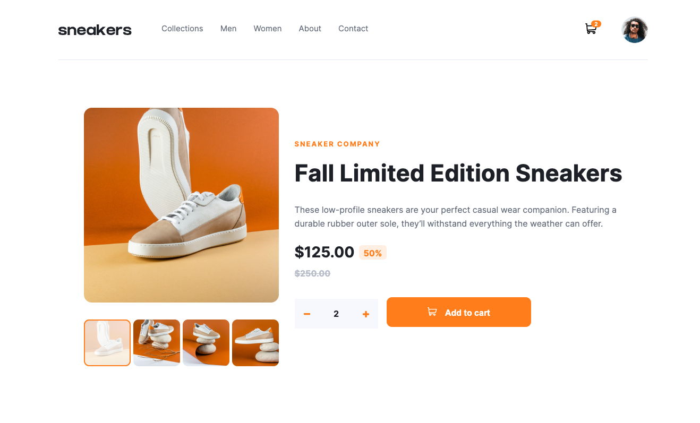
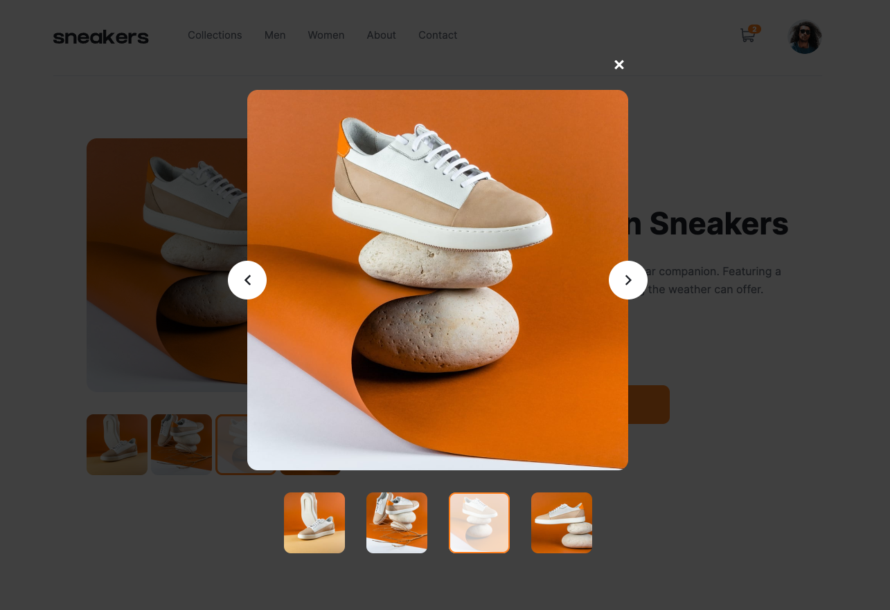
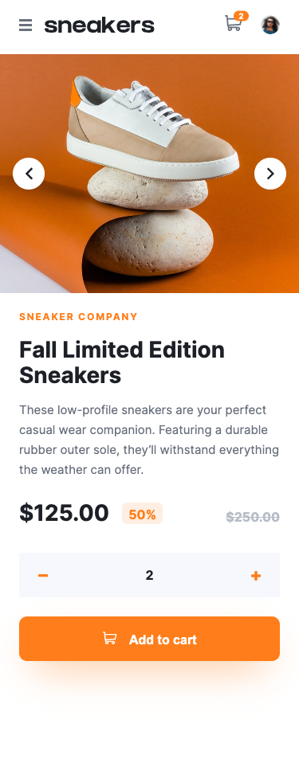

# Sneakers - An e-commerce product page


## About 📝

A sample product details page for an e-commerce site for sneakers. Design provided by frontendmentors.io. Deploted with [Github Pages.](https://livinson.github.io/sneakers-ecommerce/)







## Run Locally 🏃🏿‍♀️

Clone this repository and navigate into the sneakers directory.

```bash
git git@github.com:LiVinson/sneakers-ecommerce.git
cd sneakers
```

Install all of the dependencies listed in the package.json

```node
npm install
```

Open the application using the vite server

```bash
npm run dev start
```


## Tools and Technology 💻

* React
* Styled Components
* React Inline SVG

## Contributions 🤝🏾

I am not open to accepting pull requests at this time, but feel free to fork the repository to make changes on your own.

## License 🔓

This project is licensed under the [MIT license](https://github.com/LiVinson/sneakers-ecommerce/tree/main).
